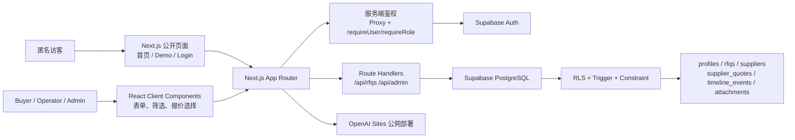

# 02 架构与技术选型

## 1. 总体架构



浏览器负责界面和局部交互，Next.js 服务端负责页面/API 权限判断，Supabase Auth 提供身份，会话携带的用户 ID 最终由 PostgreSQL RLS 再次校验数据访问范围。

## 2. 技术选型

### Next.js App Router

- 文件系统路由清晰，公开、Buyer 和 Admin 页面可按目录组织。
- Server Component 适合在服务端读取 Supabase 数据，减少敏感业务数据在客户端暴露。
- Route Handler 用同一项目实现轻量后端接口。
- `loading.tsx`、`error.tsx` 提供统一加载和异常体验。

### TypeScript

- `lib/types.ts` 保存 UI 领域类型，`lib/database.types.ts` 保存数据库类型。
- RFQ 状态映射通过 `satisfies` 保证数据库枚举与界面状态一致。
- API 和组件不使用 `any` 逃避检查。

### Tailwind CSS

- 适合快速建立一致的 B2B 视觉系统和响应式断点。
- 公共样式集中在 `app/globals.css`，复杂页面用组合类完成。
- 不依赖大型 UI 组件库，减少课程项目依赖和样式黑盒。

### Supabase

- Auth 提供邮箱密码登录、验证、恢复和会话。
- PostgreSQL 提供关系、约束、索引、函数和触发器。
- RLS 把“Buyer 只能看自己的数据”落实在数据库层，即使绕过页面也无法越权。
- 托管服务减少自建认证服务器与数据库运维。

## 3. 前后端与数据库关系

1. Client Component 收集表单或交互状态。
2. 浏览器调用 Next.js Route Handler。
3. Route Handler 先执行 `getApiAuth` 检查登录和角色。
4. Supabase 客户端带当前用户会话访问 PostgreSQL。
5. RLS 根据 `auth.uid()` 和 `profiles.role` 再次判断。
6. 数据库约束、触发器保证字段完整性、更新时间和默认时间线。

## 4. 目录结构

```text
app/                    页面、布局、Route Handlers
components/
  admin/                管理后台组件
  auth/                 登录、退出、认证壳层
  dashboard/            Buyer 工作台
  demo/                 公开课程 Demo
  home/                 首页组件
  layout/               Header / Footer
  rfq/                  表单、报价、成本、时间线
  ui/                   Button、状态、标题等基础组件
lib/                    类型、验证、Mock、Supabase 和鉴权
supabase/migrations/    数据库结构、RLS、函数和触发器
tests/                  渲染、验证、安全契约测试
scripts/                真实 Supabase 集成验收
docs/                   课程提交文档
```

项目现有 19 个 `.tsx` 组件，超过课程要求的 10 个组件。

## 5. 权限与鉴权设计

- Proxy 保护 `/dashboard`、`/rfqs`、`/admin`、`/api/rfqs`、`/api/admin`。
- `requireUser` 保护登录页面数据；`requireRole`/`requireStaff` 保护运营页面。
- API 未配置返回 503，匿名返回 401，角色不足返回 403。
- RLS 保护六张业务表；匿名角色被显式撤销权限。
- Buyer 只能读写自己 RFQ 的授权字段，不能改 owner、编号或状态。
- Operator/Admin 可处理全部业务数据；只有 Admin 可调用角色 RPC。
- `/demo` 只读取 `lib/mock-data.ts`，不访问真实数据库。
